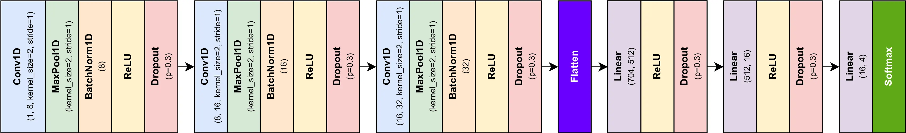
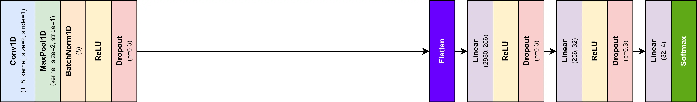
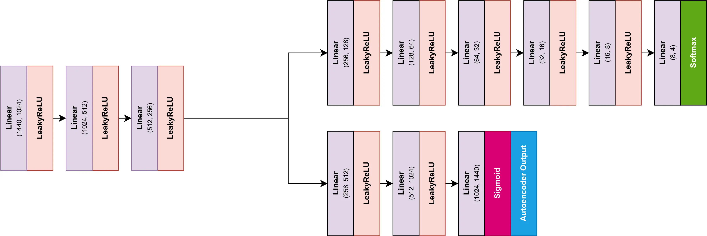
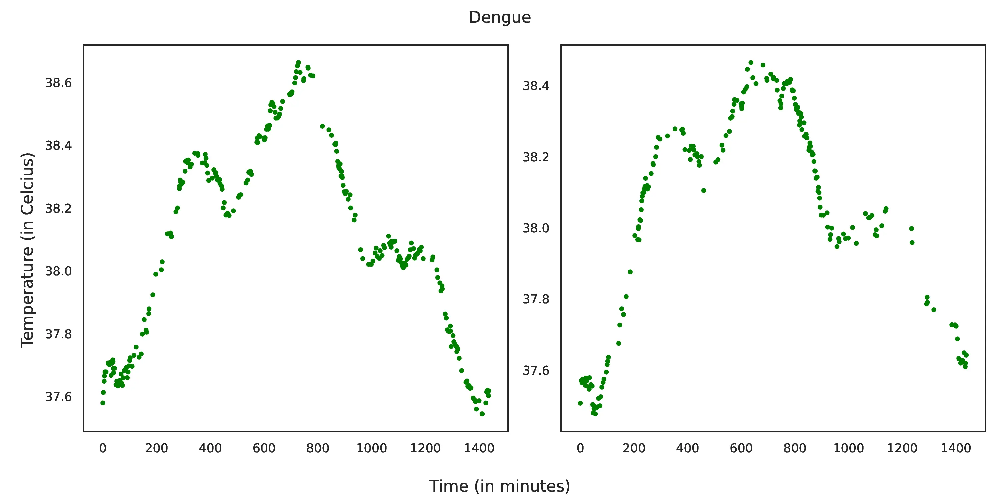
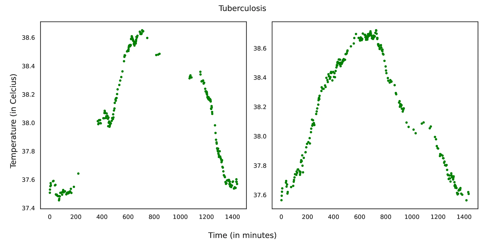
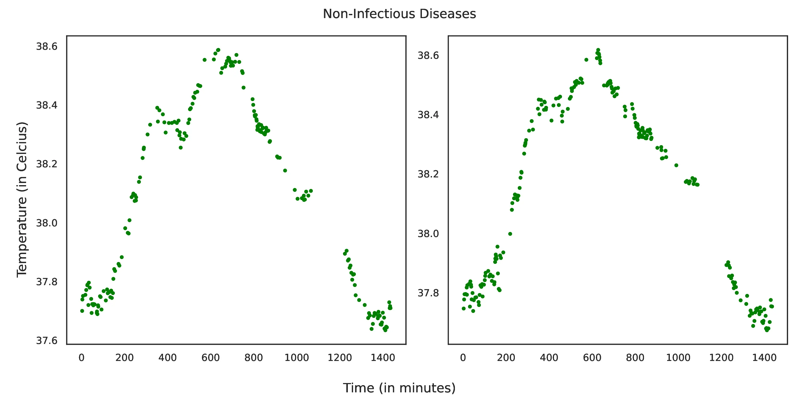
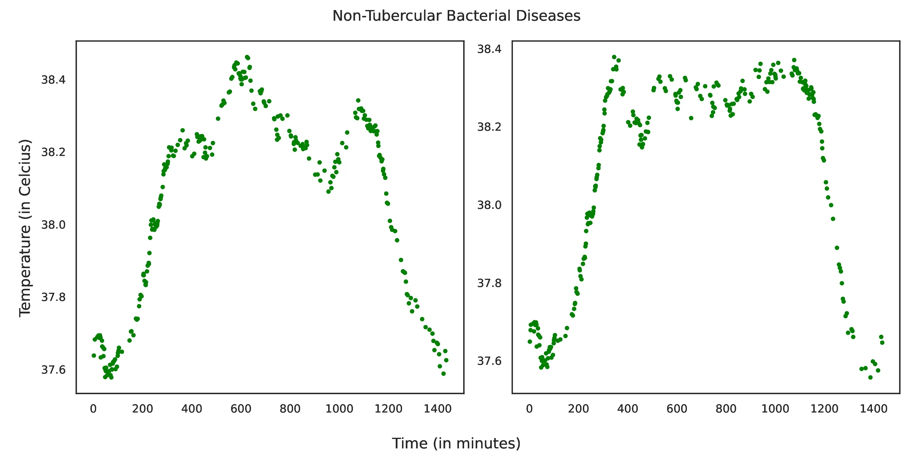

Update: We won the Best Paper Award at the IEEE AICECS 2024!

This paper has been accepted to the IEEE Third International Conference on Artificial Intelligence, Computational Electronics and Communication System (AICECS 2024).

View the code [here](https://github.com/anirudhprabhakaran3/extemp).

# Abstract

Tympanic temperature is one of the most fundamental indicators for diagnoses of diseases.
In a hospital setting, temperature is a fundamental metric that tracks a patient’s status.
Due to its importance, it would be very useful to use temperature data of patients to aid in the diangostic process.
However, it is quite hard to predict diseases from just fever patterns.
In this paper, we work towards two problem statements:

- Try to predict disease given fever temperature data.
- Try to identify the distinct, characteristic patterns in temperature information for various diseases.

We introduce three new models for Explainable Temperature analysis - ExTempConv-SM, ExTempConv-LG, and ExTemp-Auto.
Along with this, we use explainable AI tools to try to identify distinguishing patterns in temperature fluctuations that can characterize diseases.
Using GradCAM, we note the distinct temperature patterns that are unique to particular diseases.

# Method

We provide two such models, named ExTempConv-SM and ExTempConv-LG.
Both of these are based on convolution blocks, followed by a fully connected neural network to perform classification.
The difference in the two models comes from slight differences in the architecture, leading to a difference in the number of parameters for each model.

{.lightbox}

{.lightbox}

There has also been previous work to denote that convolution blocks act as an effective method for dimensionality reduction.
We explore this idea more, and look at other promising methods for dimensionality reductions.
Using the same thought process, we replace the convolution blocks in our proposed network with the encoder block of an autoencoder.
This is the motivation behind the third model - ExTemp-Auto.

{.lightbox}

# Results

We note that the best model performance is achieved by the ExTempConv-LG model (70%).

| Model | Precision | Recall | F1-Score | Accuracy |
| :--- | :---: | :---: | :---: | :---: |
| **ExTempConv-SM** | 0.62 | 0.55 | 0.62 | 0.65 |
| **ExTempConv-LG** | 0.60 | 0.57 | 0.55 | 0.70 |
| **ExTemp-Auto** | 0.56 | 0.52 | 0.51 | 0.52 |

We also apply GradCAM to our models to try to understand which unique tempearture patterns are characteristic for particular diseases.
We note these patterns generated from ExTempConv-LG.

{.lightbox}

{.lightbox}

{.lightbox}

{.lightbox}